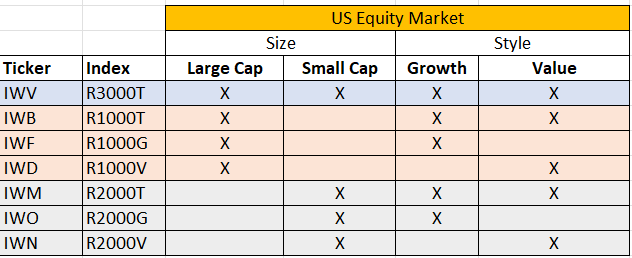

# HustleTheRussell

The Russell US Indexes, from mega cap to microcap, serve as leading benchmarks for institutional investors. The modular index construction allows investors to track current and historical market performance by specific market segment (large/mid/small/micro cap) or investment style (growth/value/defensive/dynamic). All sub-indexes roll up to the Russell 3000® Index. The Russell US Indexes can be used as performance benchmarks, or as the basis for index-linked products including index tracking funds, derivatives, and Exchange Traded Funds (ETFs).

In HussleTheRussell, we are analyzing the top 7 Russell indexes to determine how our models will perform compared to their perspective index. We have pulled data from Alpaca to get baseline data which we have used to model, test, and predict future returns. The following is what we discovered.

## Dates

Start Date of Training Data: 01/01/2018

Start Date of Prediction Data: 10/31/2022

End Date of Prediction Data: 6/30/2023

## Indices

## Summary

Our analysis attemps to predict future performance of various equity market stylistic factors by analyzing historical return profiles of 7 Russell ETFs that comprise the entire spectrum of the US equity market. This analysis will also incorporate macroeconomic data points that will help us describe results and potential deviations in predicted relative returns. 

Tools:
* Alpaca
* Jupyter Lab
* Pandas
* Sklearn
* keras
* hv.plot
* macroeconomic data (government sites)

> ## Backgound of the Russell:
>
>> Created in 1984, the Russell 2000 Index follows the performance of a group of roughly 2,000 small-cap stocks and is a common economic indicator for that segment of the U.S. market.
>>
>> The Russell 2000 is an important stock index because owning stocks of various sizes is a common way people diversify their investments. Other well-known indices, including the Dow Jones Industrial Average and the S&P 500, focus on large-cap stocks of well-established companies. But the Russell 2000 is a popular index for gauging returns on U.S. small-cap stocks.

**Seven indices we chose to focus on:**

> ### **IWV** iShare Russell 3000 ETF:
>> Overview:
>> Exposes its investors to a broad range of U.S. companies and provides access to 3000 domestic stocks in a single fund. Investors use it to seek long-term growth.
>>
>>Objective: The iShares Russell 3000 ETF seeks to track the investment results of a broad-based index composed of U.S. equities.

> ### **IWB** iShare Rusell 1000 ETF:
>> Overview:
>> Exposes it's investors to large U.S. companies and provides them access to 1000 domestic stocks in a single fund. Investors use it to seek long-term growth.
>>
>> Objective: The iShares Russell 1000 ETF seeks to track the investment results of an index composed of large and mid-capitalization U.S. equities.

> ### **IWF** iShares Russell 1000 Growth ETF:
>> Overview:
>> It exposes it's investors to U.S. companies whose earnings are expected to grow at an above rate relative to the market. It offers targeted access to a specific category of domestic stocks. It tilts the investors' portfolio towards growth stocks.
>>
>>Objective: iShussell 1000 Growth ETF seeks to track the investment results of an index composed of large- and mid-capitalization U.S. equities with growth characteristics.

> ### **IWD** iShares Russell 1000 Value ETF:
>> Overview:
>> It exposes it's investors to U.S. companies that are considered undervalued by the market relative to comparable companies. It offers targeted access to a specific category of domestic stocks. It tilts the investors' portfolio towards value stocks.
>>
>> Objective: The iShares Russell 1000 Value ETF seeks to track the investment results of an index composed of large- and mid-capitalization U.S. equities that exhibit value characteristics.

> ### **IWM** iShares Russell 2000 Value ETF:
>> Overview:
>> It exposes the investors to small public companies that are considered undervalued by the market relative to comparable companies. It offers targeted access to a specific category of small-cap domestic stocks. Investors use it to diversify a U.S. stock allocation and tilt the investors' portfolios toward value stocks.
>>
>> Objective: The iShares Russell 2000 Value ETF seeks to track the investment results of an index composed of small-capitalization U.S. equities that exhibit value characteristics.

> ### **IWO** iShares Russell 2000 Growth ETF:
>> Overview:
>> It exposes investors to small public U.S. companies whose earnings are expected to grow above average relative to the market. It offers targeted access to a specific category of small-cap domestic stocks. Investors use it to diversify U.S. allocation and tilt the investors' portfolios toward growth stocks.
>>
>> Objective: The iShares Russell 2000 Growth ETF seeks to track the investment results of an index composed of small-capitalization U.S. equities that exhibit growth characteristics.

> ### **IWN** iShares Russell 2000 Value ETF:
>> Overview:
>> It exposes investors to small public U.S. companies that are considered undervalued by the market relative to comparable companies. It offers targeted access to a specific category of small-cap domestic stocks. Investors use it to diversify U.S. allocation and tilt the investors' portfolios toward value stocks.
>>
>> Objective: The iShares Russell 2000 Value ETF seeks to track the investment results of an index composed of small-capitalization U.S. equities that exhibit value characteristics.

The objective of Russell 2000: The Russell 2000 is an important stock index because owning stocks of various sizes is a common way people diversify their investments. Other well-known indices, including the Dow Jones Industrial Average and the S&P 500, focus on large-cap stocks of well-established companies. But the Russell 2000 is a popular index for gauging returns on U.S. small-cap stocks.

Source: iShares by Blackrock

## Model Analysis

https://files.slack.com/files-pri/T04MZJY0WB0-F05GNSH9KPW/cumprods.png

## References only REMOVE THIS BEFORE PRESENTATION!:

> #### The quarterly results look great!
>
> - Revenue was off the chart.
> - Profits were higher than ever.
>
>  *Everything* is going according to **plan**.

Create a Jupyter Notebook, Google Colab Notebook, or Amazon SageMaker Notebook to prepare a training and testing dataset.

 Optionally, apply a dimensionality reduction technique to reduce the input features, or perform feature engineering to generate new features to train the model.

 Create one or more machine learning models.

 Fit the model(s) to the training data.

 Evaluate the trained model(s) using testing data. Include any calculations, metrics, or visualizations needed to evaluate the performance.

 Show the predictions using a sample of new data. Compare the predictions if more than one model is used.

 Save PNG images of your visualizations to distribute to the class and instructional team and for inclusion in your presentation and your repo's README.md file.

 Use one new machine learning library, machine learning model, or evaluation metric that hasn't been covered in class.

 Create a README.md in your repo with a write-up summarizing your project. Be sure to include any usage instructions to set up and use the model.
