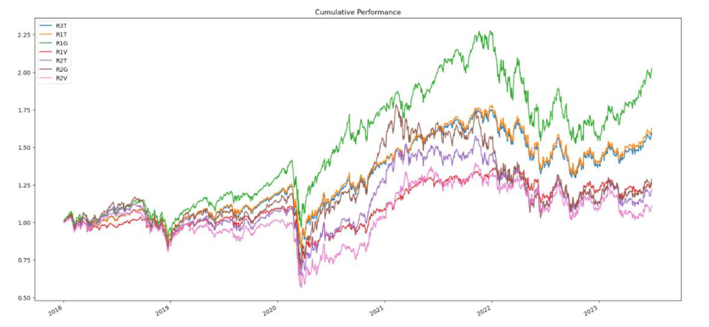

# HustleTheRussell

The Russell US Indexes, from mega cap to microcap, serve as leading benchmarks for institutional investors. The modular index construction allows investors to track current and historical market performance by specific market segment (large/mid/small/micro cap) or investment style (growth/value/defensive/dynamic). All sub-indexes roll up to the Russell 3000® Index. The Russell US Indexes can be used as performance benchmarks, or as the basis for index-linked products including index tracking funds, derivatives, and Exchange Traded Funds (ETFs).

In HussleTheRussell, we are analyzing the top 7 Russell indexes to determine how our models will perform compared to their perspective index. We have pulled data from Alpaca to get baseline data which we have used to model, test, and predict future returns. The following is what we discovered.

The HussleTheRussell team took two different approaches on this project. First, we used one regression model to review it's performance against multiple indices. Secondly, we used multiple models to review their performance against a single index. 

> ## Backgound of the Russell:
>
>> Launched in 1984, the Russell 3000 Index is a capitalization-weighted stock market index that seeks to be a benchmark of the entire U.S. stock market. It measures the performance of the 3,000 largest publicly held companies incorporated in America as measured by total market capitalization and represents approximately 97% of the American public equity markets.

**Seven indices we chose to focus on:**

> ### **IWV** iShare Russell 3000 ETF:
>> Overview:
>> Exposes its investors to a broad range of U.S. companies and provides access to 3000 domestic stocks in a single fund. Investors use it to seek long-term growth.
>>
>>Objective: The iShares Russell 3000 ETF seeks to track the investment results of a broad-based index composed of U.S. equities.

> ### **IWB** iShare Rusell 1000 ETF:
>> Overview:
>> Exposes it's investors to large U.S. companies and provides them access to 1000 domestic stocks in a single fund. Investors use it to seek long-term growth.
>>
>> Objective: The iShares Russell 1000 ETF seeks to track the investment results of an index composed of large and mid-capitalization U.S. equities.

> ### **IWF** iShares Russell 1000 Growth ETF:
>> Overview:
>> It exposes it's investors to U.S. companies whose earnings are expected to grow at an above rate relative to the market. It offers targeted access to a specific category of domestic stocks. It tilts the investors' portfolio towards growth stocks.
>>
>>Objective: iShussell 1000 Growth ETF seeks to track the investment results of an index composed of large- and mid-capitalization U.S. equities with growth characteristics.

> ### **IWD** iShares Russell 1000 Value ETF:
>> Overview:
>> It exposes it's investors to U.S. companies that are considered undervalued by the market relative to comparable companies. It offers targeted access to a specific category of domestic stocks. It tilts the investors' portfolio towards value stocks.
>>
>> Objective: The iShares Russell 1000 Value ETF seeks to track the investment results of an index composed of large- and mid-capitalization U.S. equities that exhibit value characteristics.

> ### **IWM** iShares Russell 2000 Value ETF:
>> Overview:
>> It exposes the investors to small public companies that are considered undervalued by the market relative to comparable companies. It offers targeted access to a specific category of small-cap domestic stocks. Investors use it to diversify a U.S. stock allocation and tilt the investors' portfolios toward value stocks.
>>
>> Objective: The iShares Russell 2000 Value ETF seeks to track the investment results of an index composed of small-capitalization U.S. equities that exhibit value characteristics.

> ### **IWO** iShares Russell 2000 Growth ETF:
>> Overview:
>> It exposes investors to small public U.S. companies whose earnings are expected to grow above average relative to the market. It offers targeted access to a specific category of small-cap domestic stocks. Investors use it to diversify U.S. allocation and tilt the investors' portfolios toward growth stocks.
>>
>> Objective: The iShares Russell 2000 Growth ETF seeks to track the investment results of an index composed of small-capitalization U.S. equities that exhibit growth characteristics.

> ### **IWN** iShares Russell 2000 Value ETF:
>> Overview:
>> It exposes investors to small public U.S. companies that are considered undervalued by the market relative to comparable companies. It offers targeted access to a specific category of small-cap domestic stocks. Investors use it to diversify U.S. allocation and tilt the investors' portfolios toward value stocks.
>>
>> Objective: The iShares Russell 2000 Value ETF seeks to track the investment results of an index composed of small-capitalization U.S. equities that exhibit value characteristics.

Source: iShares by Blackrock

## Dates and Tools

Start Date of Training Data: 01/01/2018

End Date of Prediction Data: 6/30/2023 

Tools:
* Alpaca
* Jupyter Lab
* Pandas
* Sklearn
* hv.plot

## Indices

Large Cap = large companies such as Apple, Microsoft, etc. (typically > $40-50B)  
Small Cap = smaller companies (typically less than $6-7B)  

Growth = higher PE ratios, earlier stage companies with more growth potential  
Value = lower PE ratios, higher book/value ratios, higher dividend yields (spend on dividends to keep investors interested given lower growth potential)  

**Over 5.5 year period:**  
Significant outperformance of large cap stocks (especially growth)  
Growth stocks across cap rebounded better after recession due to injection of cash into markets and lower rates, creating an optimal situation for companies with higher levels of debt  

Using the logistic regression and predicted B/S signals, back-tested trading algorithms.

**Russell 1000 Total**

**Russell 1000 Value**

**Russell 2000 Value**

## Model Analysis Using IWV

In this part of the project, we will develop trading strategies using various machine learning algorithms. We use the IWV index as an example since it tracks the investment results of a broad-based index composed of U.S. equities. 

The input variables are the fast and slow simple moving averages (4 and 100 days, respectively). The target is the trading signal (1:buy, -1: sell) based on the actual return for each day. We split the data into training and testing samples. The input variables are normalized using StandardScaler. We considered seven machine learning models:

* Logistic Regression
* Support Vector Machines
* Decision Trees
* Random Forest
* K-Nearest Neighbor
* Gradient Boosting
* AdaBoost

After training the models on the training data, we evaluated the performance of each model on the testing data. This table summarizes the accuracy, precision and recall of each model:

| |Accuracy |Precision (-1) |Recall (-1) |Precision (1) |Recall (1)|
|:----|:----|:----|:----|:----|:----|
|Logistic Regression |0.531635 |0.452055 |0.058615 |0.536713 |0.938838|
|Support Vector Machines |0.540674 |0.833333 |0.008881 |0.539224 |0.998471|
|Decision Trees |0.534100 |0.444444 |0.028419 |0.536833 |0.969419|
|Random Forest |0.535744 |0.476190 |0.035524 |0.537872 |0.966361|
|K-Nearest Neighbor |0.537387 |0.500000 |0.039076 |0.538789 |0.966361|
|Gradient Boosting |0.534922 |0.451613 |0.024867 |0.537099 |0.974006|
|AdaBoost |0.537387 |0.500000 |0.021314 |0.538139 |0.981651|

This figure shows the accumulative returns using each model.

### Takeaways

The Support Vector machines model outperformed the actual returns over the time period, while the Logistic Regression model underperformed.   

We see a lot of variability in the models that we tested. While the majority of our models outperformed the IWV, we see room for improvement. Overall, we did not predict selling signals with much accuracy.  

The precision of the Vector Machines model is much higher than other models. We believe this resulted in the model outperforming other models and the IWV.  

To expand on this project, we could have applied these models to additional indicies and then compared models accross those indicies. 

## Team 2 Contributors:

Susan Bengo - Conclusion 
Michael Cody - Data  
TJ Wentling - Intro  
Tingjun Yang - Data  

## References only REMOVE THIS BEFORE PRESENTATION!:

> #### The quarterly results look great!
>
> - Revenue was off the chart.
> - Profits were higher than ever.
>
>  *Everything* is going according to **plan**.

Create a Jupyter Notebook, Google Colab Notebook, or Amazon SageMaker Notebook to prepare a training and testing dataset.

 Optionally, apply a dimensionality reduction technique to reduce the input features, or perform feature engineering to generate new features to train the model.

 Create one or more machine learning models.

 Fit the model(s) to the training data.

 Evaluate the trained model(s) using testing data. Include any calculations, metrics, or visualizations needed to evaluate the performance.

 Show the predictions using a sample of new data. Compare the predictions if more than one model is used.

 Save PNG images of your visualizations to distribute to the class and instructional team and for inclusion in your presentation and your repo's README.md file.

 Use one new machine learning library, machine learning model, or evaluation metric that hasn't been covered in class.

 Create a README.md in your repo with a write-up summarizing your project. Be sure to include any usage instructions to set up and use the model.
